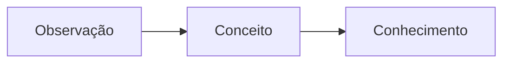

# Saberes Absolutos

Esta seção reúne conceitos e fundamentos apresentados como invariantes dentro do contexto da enciclopédia.

## Exemplo matemático

A relação entre energia e massa pode ser expressa por:

$$
E = mc^2
$$

## Exemplo de diagrama

